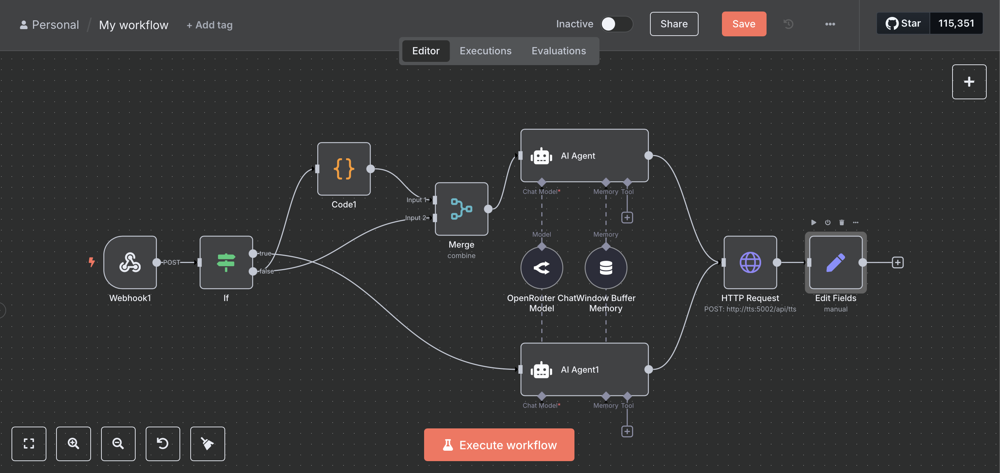

# Emergency Response Training System with n8n

An AI-powered training platform for emergency response scenarios, built during the Bosch Hackathon. This system simulates realistic emergency situations to help train first responders through conversational AI.



## Project Overview

This project was developed during a 12-hour Bosch Hackathon by a team of three. Despite having limited n8n experience (just one week), we successfully created a functional emergency response training system in the first 6 hours. The remaining time was spent experimenting with voice models for future enhancements.

## Use Case

The system is designed to train first responders for car accident scenarios through simulated emergency calls:

- **Training Simulation**: The system presents 4 different emergency scenarios to choose from
- **AI Victim Role-Play**: An LLM model impersonates accident victims, providing realistic responses
- **Performance Evaluation**: After each session, a second AI model evaluates the first responder's performance
- **Comprehensive Feedback**: Generates transcripts and performance ratings for training purposes

### How It Works

1. **Scenario Selection**: User selects from 4 pre-defined emergency scenarios
2. **Chat Interface**: Simple JavaScript-based chat interface for quick interaction
3. **AI Conversation**: First AI agent responds as the victim based on the selected scenario
4. **Session Recording**: All conversations are saved to a database for analysis
5. **Performance Review**: Second AI agent evaluates the conversation and provides feedback

## 🛠️ Tech Stack

- **Workflow Engine**: [n8n](https://n8n.io/) - No-code automation platform
- **Database**: PostgreSQL for conversation storage
- **Reverse Proxy**: Caddy for serving the application
- **Frontend**: Vanilla JavaScript (rapid prototyping approach)
- **AI Models**: OpenRouter API integration
- **Containerization**: Docker Compose for easy deployment

### Architecture

```
Frontend (JavaScript) → Webhook → n8n Workflow → AI Models → Database → Evaluation
```

The system uses webhooks to trigger n8n workflows, which route conversations through different AI agents based on the scenario and conversation state.

## 🚀 Quick Start

### Prerequisites

- Docker and Docker Compose
- OpenRouter API key

### Installation

1. **Clone the repository**
   ```bash
   git clone <repository-url>
   cd AgenticAI-workflow-n8n-Hackathon
   ```

2. **Configure API credentials**
   - Add your OpenRouter API key to the n8n credentials
   - Update the webhook URLs if needed

3. **Start the application**
   ```bash
   make up
   ```

4. **Access the application**
   - Open your browser and navigate to `http://localhost:8080`
   - Select a scenario and start the conversation
   - Click "Stop" when the conversation is complete to receive evaluation

### Available Commands

```bash
make up      # Start all services
make down    # Stop all services
make logs    # View application logs
```

## Future Enhancements

- **Voice Integration**: Replace text chat with voice-powered conversations
- **Advanced Scenarios**: Add the possibility to create your scenarios
- **Analytics Dashboard**: Comprehensive training progress tracking

## Contributing

This project was built during a hackathon and serves as a simple proof of concept. 

